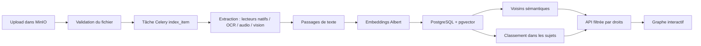

# Graphe des fichiers

La feature complète est sur `main` : extraction, embeddings, stockage, liens,
sujets choisis par l’utilisateur et interface. La branche historique
`graph-extraction` n’est plus nécessaire. Les anciens sujets automatiques ont
été retirés ; les groupes visuels ne créent pas de sujets dans la base.

## Parcours d’un fichier



Le fichier apparaît avant la fin de son analyse. Le frontend recharge les données
toutes les quatre secondes tant qu’un fichier est en attente. Le traitement est
asynchrone : « apparaît immédiatement » ne veut pas dire « déjà vectorisé ».
Les états `pending`, `indexed`, `empty`, `failed`, `skipped` et `idle` permettent de
suivre le résultat sans afficher un chargement permanent.

## Repères dans le code

| Partie | Fichiers |
| --- | --- |
| Orchestration, reprises, actualisation des voisins | `tasks.py`, `signals.py` |
| Texte, OCR, transcription et description d’images | `services/extraction.py`, `tasks.py` |
| Découpage, appels à Albert | `services/chunking.py`, `services/albert.py` |
| Passages, vecteurs, liens, sujets, états | `models.py`, `services/storage.py` |
| Liens et passages justifiant un rapprochement | `services/linking.py` |
| Sujets et reclassement des nouveaux fichiers | `services/subjects.py` |
| Droits et périmètre de chaque utilisateur | `services/scope.py` |
| Résumé contextuel et explication des liens | `services/brief.py` |
| API du graphe et des sujets | `api.py`, `viewsets.py`, `serializers.py` |
| Corpus de démonstration | `services/seed.py`, `services/documents.py` |
| Interface, filtres et simulation | `../../frontend/apps/drive/src/features/graph/` |

## Vecteurs et liens

Chaque passage porte un embedding normalisé de **1 024 dimensions**. Les passages
sont stockés dans PostgreSQL avec pgvector et un index HNSW cosinus. Changer la
dimension nécessite une migration et un recalcul des embeddings.

Le vecteur d’un fichier est la moyenne normalisée de ses passages. Les liens
comparent ce vecteur aux passages des autres fichiers : le poids indique une
similarité, pas une probabilité de pertinence ni une preuve de doublon. Le backend
conserve jusqu’à `GRAPH_LINKS_PER_FILE` voisins (24 par défaut) et l’API en transmet
jusqu’à dix par fichier. Les droits sont appliqués avant de transmettre les nœuds
et leurs liens au navigateur.

Les empreintes du contenu identifient les copies ayant les mêmes passages. Une
similarité supérieure ou égale à 95 % signale aussi un doublon potentiel dans
l’interface ; elle ne prouve pas que les fichiers sont identiques. Une suppression
passe par confirmation et envoie le fichier à la corbeille.

## Sujets

Un sujet appartient à un utilisateur : nom, description et fichiers épinglés.
Les embeddings présélectionnent jusqu’à 60 fichiers ; le reranker Albert lit leur
texte face au nom et aux lignes de description du sujet. Les scores sont rapportés
à la meilleure réponse du sujet. Un plancher absolu
(`GRAPH_TOPIC_RERANK_FLOOR`, 0,05 par défaut) évite qu’un sujet sans réponse accepte
son fichier le moins mauvais. Les fichiers épinglés restent un choix explicite.

La même règle s’applique aux nouveaux uploads et aux anciennes appartenances
renvoyées par l’API. Un upload réellement pertinent peut réactiver un sujet vide.
Dans le frontend, les appartenances retenues servent aux filtres, aux couleurs,
aux libellés, au compteur des fichiers sans sujet et au thème du résumé.

Le classement reste une estimation du modèle : les scores de sujets différents
ne sont pas des probabilités comparables. Pour la démonstration, choisir des
sujets précis correspondant au corpus et vérifier les documents proposés.

## Parcours de démonstration

1. Ouvrir le graphe : les couleurs représentent les sujets et les formes les
   droits sur les fichiers. Le bouton **Vue d’ensemble** restaure le cadrage et
   retire la recherche et les filtres.
2. Cliquer sur un sujet puis chercher un mot : recherche et filtres se combinent,
   avec un compteur des fichiers correspondants. Ouvrir un résultat pour lire son
   résumé et l’explication de ses liens, puis suivre un document voisin.
3. Utiliser **Sans sujet** pour retrouver les documents à organiser et
   **Doublons possibles** pour examiner les copies candidates. Un score de
   similarité ne suffit pas à décider d’une suppression.
4. Ouvrir **Guide**, choisir une activité et examiner les sujets proposés avant
   de les créer. Les sujets déjà présents sont reconnus sans tenir compte de la
   casse. Les créations réussies ne sont pas répétées après une erreur.
5. Créer un sujet précis avec sa description, puis montrer les documents retenus.
   Les sujets sans résultat sont accessibles dans une liste repliée.

Le thème clair est utilisé à la première visite ; le choix de thème enregistré
reste prioritaire. Les formulaires attendent la réponse du serveur et conservent
leur saisie en cas d’échec.

## API

- `GET /api/v1.0/graph/` : fichiers accessibles, liens, sujets et dossiers.
- `GET /api/v1.0/graph/?folder=<uuid>` : même graphe limité à un dossier.
- `GET /api/v1.0/graph/files/<uuid>/brief/?subject=<texte>&with=<uuid>,<uuid>` :
  résumé du document et explication de ses voisins, avec contrôle des droits.
- `/api/v1.0/graph/topics/` : création, lecture, modification et suppression des
  sujets ; sous-routes `files/` pour épingler ou détacher un fichier.

Les résumés sont calculés à l’ouverture de la carte et mis en cache. Ils lisent
un extrait du contenu et peuvent signaler qu’un fichier ne répond pas au sujet.

## Vérifier et déployer

Depuis la racine du dépôt :

```bash
bin/pytest graph
# Avec la pile de développement déjà démarrée :
docker compose exec -T -e DJANGO_CONFIGURATION=Test app-dev pytest graph --no-cov
```

Depuis `src/frontend/apps/drive` :

```bash
yarn test --runInBand src/features/graph/data/__tests__/model.test.ts
yarn build
```

Un push sur `main` déclenche **Deploy production** (`.github/workflows/deploy-prod.yml`).
Après succès, vérifier dans le navigateur les sujets, la recherche, les filtres,
l’ouverture d’un document et l’arrivée d’un upload. Le workflow manuel **Seed demo
bank** alimente un compte avec le corpus Albert ; il évite de recréer les fichiers
déjà présents.

La documentation visuelle est servie sur `/doc/` depuis `deploy/doc/`. Le graphe
existant reste consultable si Albert est indisponible, mais l’analyse de nouveaux
fichiers, le classement et les nouveaux résumés dépendent de son API.
